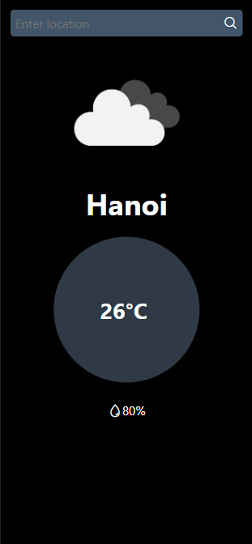
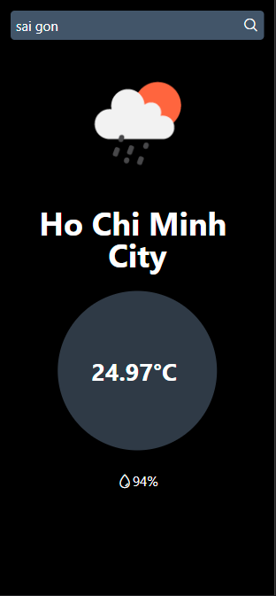
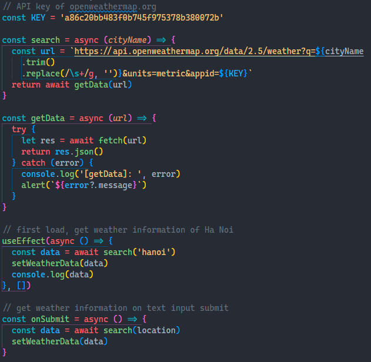

# Weather app

This project was created with [expo](https://docs.expo.dev/get-started/create-a-new-app/)

## Available Scripts

In the project directory, you can run:

`yarn start`

Runs the app in the development mode.\
Open [http://localhost:19006](http://localhost:19006) to view it in your browser.

## Features

- Receive data through API
- Show current temperature, humidity and more
- Search for weather data base on city name

## Technologies

- `React Native`
- API: [Openweathermap](https://openweathermap.org/)

## Previews

First load

Search result

Handle API
